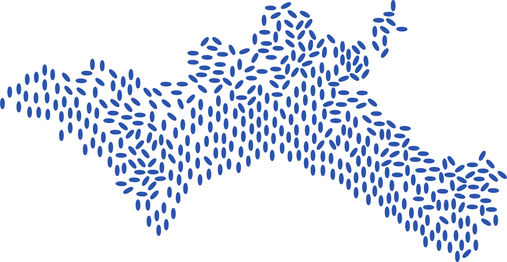
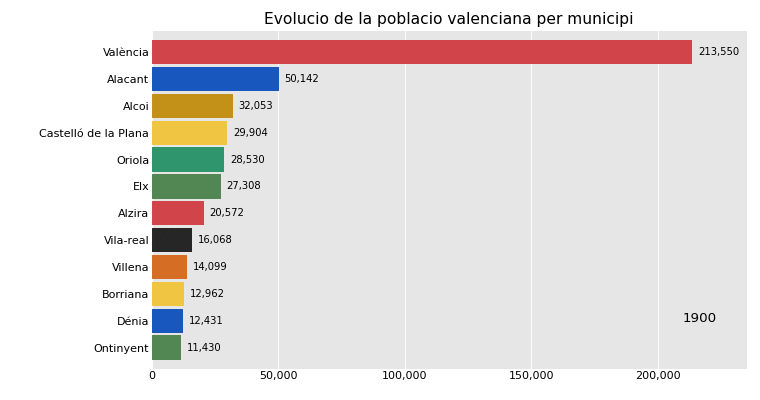

<div align="center">




# Població Valenciana

[;678+municipis+%C2%B7+3+prov%C3%ADncies+%C2%B7+125+anys+de+dades;Dataset+obert+%C2%B7+Llic%C3%A8ncia+CC0+%C2%B7+Domini+p%C3%BAblic;Actualitzaci%C3%B3+autom%C3%A0tica+des+de+l'API+de+l'INE)](https://git.io/typing-svg)

<br/>

[](LICENSE)
[](#dataset-principal-datavalencianpopcsv)
[](#qu%C3%A8-%C3%A9s-aix%C3%B2)
[](https://www.ine.es/)

</div>

---

## Visualització

<div align="center">



*Evolució de les ciutats més grans de la Comunitat Valenciana (1900–2025)*

</div>

---

## Què és això?

Un dataset consolidat amb la **població de cada municipi de la Comunitat Valenciana** des de 1900 fins a 2025. Combina dades dels censos històrics (1900–1991) i del padró municipal continu (1996–2025) publicats per l'[INE (Instituto Nacional de Estadística)](https://www.ine.es/). Les dades s'actualitzen automàticament cada trimestre via l'API de l'INE.

<div align="center">

| | | |
|:---:|:---:|:---:|
| **Alacant** | **Castelló** | **València** |
| 141 municipis | 135 municipis | 266 municipis |
|  |  |  |

</div>

---

## En xifres

<div align="center">

| | |
|:---|:---|
| **678** municipis coberts | **21.032** registres al dataset consolidat |
| **125** anys de dades (1900–2025) | **6** fitxers en brut de l'INE |
| **3** províncies completes | **1** dataset net i llest per a anàlisi |

</div>

---

## Estructura del repositori

```
poblacio-valenciana/
|- data/
|  +- valencianpop.csv           # Dataset consolidat i net (llest per a anàlisi)
|- raw/
|  |- alacant_padro_1996-2025.csv
|  |- alacant_censos_1900-1991.csv
|  |- castello_padro_1996-2025.csv
|  |- castello_censos_1900-1991.csv
|  |- valencia_padro_1996-2025.csv
|  +- valencia_censos_1900-1991.csv
|- scripts/
|  |- update_data.py             # Descarrega dades de l'API de l'INE
|  |- generate_chart.py          # Genera la visualització bar chart race
|  +- requirements.txt
|- assets/
|  |- banner.svg
|  +- bar_chart_race.gif         # Animació generada automàticament
|- .github/workflows/
|  +- update.yml                 # Actualització automàtica trimestral
|- LICENSE
+- README.md
```

---

## Dataset principal: `data/valencianpop.csv`

Fitxer CSV llest per a usar directament en qualsevol eina d'anàlisi.

<div align="center">

| Columna | Tipus | Descripció |
|:---:|:---:|:---|
| `city` |  | Nom del municipi en valencià (ex: `Alacant`) |
| `year` |  | Any (1900, 1910, ..., 1991, 1996, 1997, ..., 2025) |
| `population` |  | Població total del municipi |

</div>

>    

### Exemple

```csv
city,year,population
Alacant,1900,50142
Alacant,1910,55300
Alacant,2025,366221
València,1900,213550
València,2025,840792
```

---

## Fitxers en brut: `raw/`

Dades originals descarregades directament de l'INE. Cada fitxer correspon a una taula INE:

<div align="center">

| Fitxer | Taula INE | Província | Període | Contingut |
|:---|:---:|:---:|:---:|:---|
| `alacant_padro_1996-2025.csv` |  | Alacant | 1996–2025 | Població per municipi i sexe |
| `castello_padro_1996-2025.csv` |  | Castelló | 1996–2025 | Població per municipi i sexe |
| `valencia_padro_1996-2025.csv` |  | València | 1996–2025 | Població per municipi i sexe |
| `alacant_censos_1900-1991.csv` |  | Alacant | 1900–1991 | Censos històrics |
| `castello_censos_1900-1991.csv` |  | Castelló | 1900–1991 | Censos històrics |
| `valencia_censos_1900-1991.csv` |  | València | 1900–1991 | Censos històrics |

</div>

> **Nota:** Els fitxers en brut usen tabuladors com a delimitador, BOM UTF-8, salts de línia CRLF i format numèric espanyol (punts com a separadors de milers). El dataset consolidat (`valencianpop.csv`) ja té tot això netejat.

---

## Limitacions conegudes

```yaml
dades_buides_1997:      Molts municipis no tenen dades per a l'any 1997
buit_1992-1995:         No hi ha dades entre l'últim cens (1991) i el padró continu (1996)
municipis_desapareguts: Els codis *999 recullen població de municipis fusionats o dissolguts
només_total:            El dataset consolidat no inclou desglossament per sexe
                        (disponible als fitxers en brut del padró)
```

---

## Font de les dades

Les dades provenen de l'[Instituto Nacional de Estadística (INE)](https://www.ine.es/):

| Font | Període | Descripció |
|:---|:---:|:---|
| **Padró municipal continu** | 1996–2025 | Xifres oficials de població per municipi |
| **Censos de població** | 1900–1991 | Sèrie històrica censal |

---

## Actualització automàtica

Les dades es descarreguen directament de l'[API de l'INE](https://servicios.ine.es/wstempus/js/) i es processen amb Python.

```bash
# Actualitzar dades manualment
pip install -r scripts/requirements.txt
python scripts/update_data.py

# Regenerar visualització
python scripts/generate_chart.py
```

Un [GitHub Actions workflow](.github/workflows/update.yml) executa aquest procés automàticament cada trimestre.

---

## Llicència

Publicat sota [CC0 1.0 Universal (Domini Públic)](LICENSE). Pots usar, copiar, modificar i distribuir lliurement sense cap restricció.

---

## What is this? (English)

An open dataset with the **population of every municipality in the Valencian Community (Spain)** from 1900 to 2025. It combines historical census data (1900–1991) and continuous municipal register data (1996–2025) published by Spain's [INE (National Statistics Institute)](https://www.ine.es/).

The ready-to-use consolidated file is `data/valencianpop.csv` (CSV, UTF-8, comma-separated, ~21k rows, 678 municipalities). All municipality names are in Valencian. See the sections above for full documentation.

Licensed under [CC0 1.0 (Public Domain)](LICENSE).

---

<div align="center">


</div>
